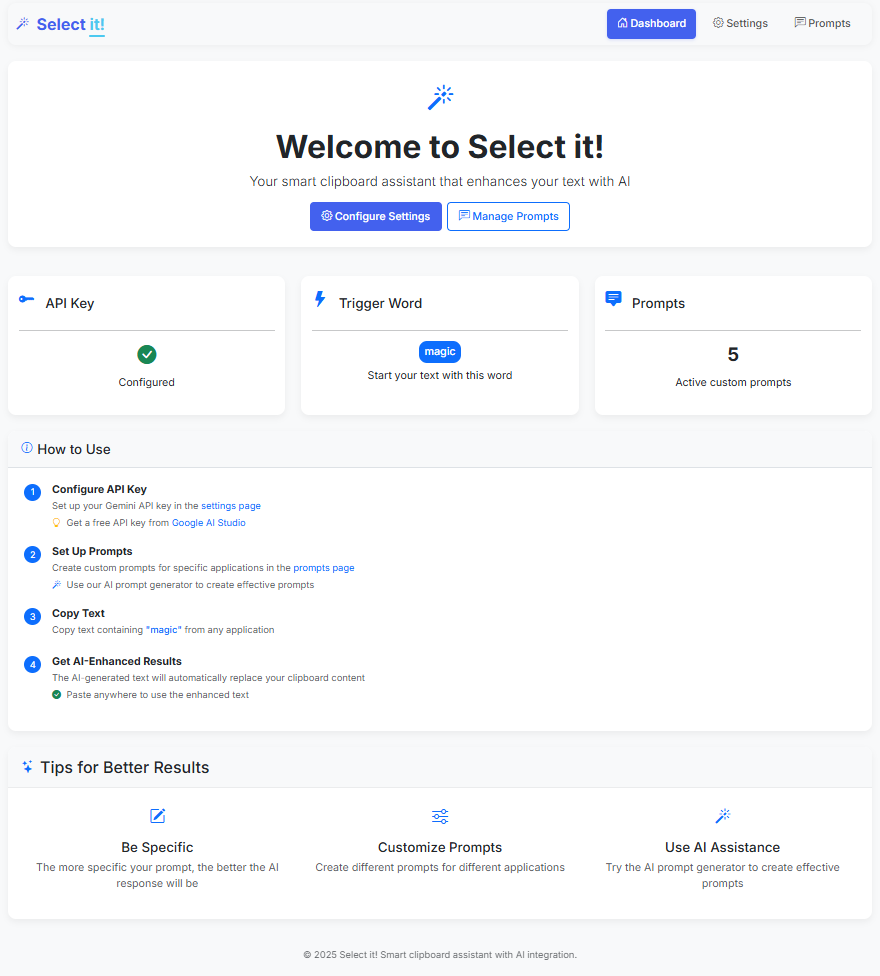

# Selit - Clipboard Monitoring Tool

Selit (Select it!) is a smart clipboard enhancement tool that monitors your clipboard and applies customized AI prompts based on the active window.


## Star history

[](https://star-history.com/#horw/selit&Date)

---

# How to Start

```
pip install -e .
```

Then, simply run:

```
selit web
```

This will start a local server on `localhost`, after which you can open the page and follow the "How to Use" steps.


